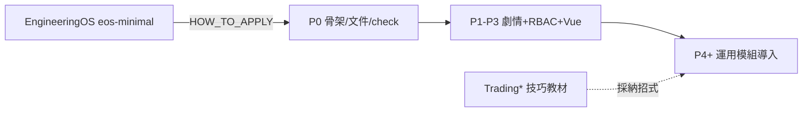
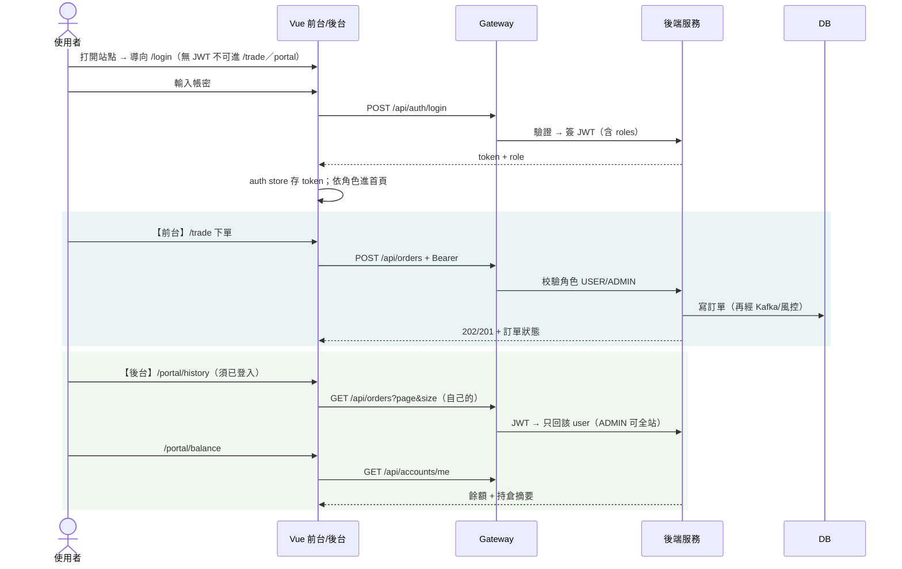
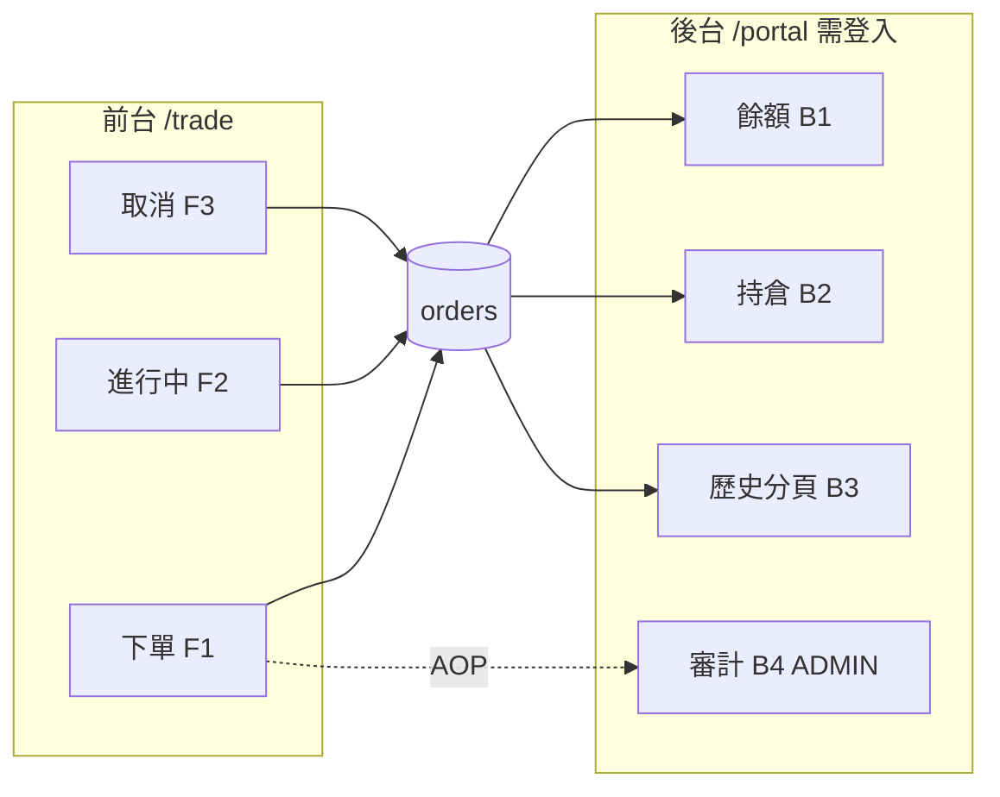

# FinTechDemo — 規格書（權威）

> **路徑**：`D:\SouceDemo\RemoteSpringBoot\FinTechDemo`  
> **工程導入**：`D:\SouceDemo\RemoteSpringBoot\EngineeringOS\eos-minimal\`（**HOW_TO_APPLY** — 開發一律走 EOS，勿手搓無規範專案）  
> **公版版本**：eos-minimal @ **0.1.10**（見 `EngineeringOS/eos-minimal/`）  
> **視覺敘事**：[codeGraphic](docs/portals/codeGraphic.html) · [技術次序與架構為什麼](docs/guides/why.html) · [產品劇情與RBAC](docs/guides/story-rbac.html)

---

## 0. 先講清楚：本專案在做什麼

### 0.1 目的（為什麼存在）

做一份**可現場 Demo 的金融交易作品**：  
使用者能在**交易前台**下單，也能在**會員／營運後台**登入後查自己的**交易歷史、餘額、持倉**；前後台共用同一套 JWT／RBAC 與後端 API。  
各 Trading* 子專案是**導入技術的運用模組**（技巧教材），不是十個要分別展示的產品 — **收進本倉庫、掛在合理劇情上**才有意義。

### 0.2 三層規劃（開發前必須對齊）

| 層 | 是什麼 | 不是什麼 |
|----|--------|----------|
| **產品劇情層** | 前台交易 ↔ 後台查詢；登入 → RBAC → 才能看歷史／餘額 | 不是先堆 Kafka／K8s |
| **技術導入層** | 按次序把 Paging／JWT／CRUD／Gateway／MS／Kafka…掛上劇情 | 不是平鋪技術清單 |
| **工程導入層** | 用 **EngineeringOS eos-minimal** 建置／分層／文件／測試／註解／上船 | 不是脫離公版各自發明結構 |

**原則**：流程要順暢、前後台要配合；**沒有登入與角色，後台查詢不開放**。技術為劇情服務；**實作服從 EOS**。  
**完整度**：對齊「一般交易系統前後台配合」的**精簡可 Demo 版**（§1.5）— 夠講、夠串，**不追求券商級完美**。

### 0.3 一句話 Demo 開場

「這是一個前後台配合的迷你券商 Demo：JWT＋RBAC 登入後，前台下單、後台查歷史與餘額；用 EngineeringOS 規範建置，再按次序導入 Gateway、微服務、Kafka 等。」

### 0.4 EngineeringOS 導入開發（強制）

本專案**不是**從空白亂長；開發入口與約束如下：

| 項目 | 路徑／規則 |
|------|------------|
| 套用手冊 | `EngineeringOS/eos-minimal/HOW_TO_APPLY.md` |
| 全域規則 | `EngineeringOS/eos-minimal/CLAUDE.md`（Controller／Service／Repo 分層、測試三層、註解、安全） |
| 模板 | `templates/spring-boot/`（多模組對齊 `module-skeleton`） |
| 前端 | `templates/spring-boot/optional-frontend/`（Vue；**本專案不採用 Node BFF**，改打 Gateway） |
| 檢查表 | `templates/spring-boot/docs/apply-checklist-zh.md`（P0 打勾） |
| 文件標準 | `knowledge/documentation.md`（SPEC／architecture／testing／DB／**驗證設計**／codeGraphic） |
| 測試標準 | `knowledge/testing.md`（Unit↔Integration 成對；本專案有壓測 → Performance） |
| 排程 | `templates/spring-boot/docs/scheduling-task.md`（Job 薄、Service 厚、ThreadPoolTaskScheduler） |
| 驗證設計 | `knowledge/validation-design.md` → 本倉 `docs/驗證設計.md`（JWT／RBAC） |
| DB 設計 | `knowledge/database-design.md` → 本倉 `docs/資料庫設計.md` |
| 薄規則 | 本倉 `CLAUDE.md` 只寫**與公版差異**，禁止整份複製 eos 後漂移 |
| 回寫 | 公版問題 → `eos-minimal/feedback/SYNC_LOG.md` |

**P0 套用步驟（對齊 HOW_TO_APPLY）**

1. 多模組目錄約定（gateway／order／risk／job／common／frontend）對齊 skeleton  
2. 填 `docs/engineering-config.md`（port、DB、coverage、scheduler）  
3. 需要的 `.template` 自 `templates/spring-boot/files/` 複製並替換 `{{...}}`  
4. `apply-checklist-zh.md` 打勾（含 Vue：`router` + `unref(isLoggedIn)` + Axios 401 排除 login）  
5. 文件缺口：可跑 `hooks/apply-tech-docs-standard.ps1 -Report`  
6. 驗證入口：`.\scripts\check.ps1` → `gradlew check`（無測試的變更不算完成）



---

## 1. 產品劇情（流程必須順）

### 1.1 角色（RBAC）

| 角色 | 代碼 | 能做什麼 | 不能做什麼 |
|------|------|----------|------------|
| 訪客 | （未登入） | 只看登入頁 | 任何交易／查詢 API |
| 交易用戶 | `USER` | 前台下單、取消自己的單；後台看**自己的**歷史／餘額／持倉 | 看別人的單、刪任意單、系統管理 |
| 管理員 | `ADMIN` | USER 能力 + 後台看**全站**訂單（分頁）、強制取消、看 audit 摘要 | （本 Demo 不做）改風控參數 UI |

對應技巧來源：TradingSpringSecurity（FilterChain 角色）+ TradingCRUD（`@PreAuthorize`／前端 router guard）。

### 1.2 前台 × 後台分工

```text
┌─────────────────────────────┐     同一 JWT / 同一 Gateway      ┌─────────────────────────────┐
│ 交易前台 Trade Desk         │ ◄─────────────────────────────► │ 會員後台 Portal             │
│ /trade                      │                                 │ /portal                     │
│ · 下單（買/賣、數量、價格）  │                                 │ · 登入後才能進               │
│ · 看自己進行中訂單狀態       │                                 │ · 交易歷史（分頁）           │
│ · 簡易成交回饋（狀態變化）   │                                 │ · 餘額查詢                   │
│                             │                                 │ · 持倉一覽                   │
│                             │                                 │ · ADMIN：全站訂單監察        │
└─────────────────────────────┘                                 └─────────────────────────────┘
                │                                                              │
                └──────────────────────┬───────────────────────────────────────┘
                                       ▼
                         Spring Security JWT + RBAC
                         （未帶 Token / 角色不符 → 401／403）
```

### 1.3 標準用戶旅程（Demo 劇本，務必可現場走完）



**劇情合理性檢查清單**

- [ ] 未登入進 `/trade` 或 `/portal/*` → 被 Vue Router 趕到 `/login`  
- [ ] 繞過前端直接打 API → 後端仍 401（前端守衛 ≠ 後端授權）  
- [ ] USER 打別人的訂單 id → 403 或 404（不可洩漏）  
- [ ] 前台下的單，後台歷史**立刻／刷新後**看得到（同一 `orders` 真相）  
- [ ] 成交／接受後，餘額與持倉與訂單狀態一致（簡化規則見 §4）

### 1.4 Vue 前端結構（對齊 TradingCRUD 範例）

| 項目 | 規格 |
|------|------|
| 路由 | `vue-router`：`/login`（guest）、`/trade`（requiresAuth）、`/portal/*`（requiresAuth） |
| 守衛 | `beforeEach`：`requiresAuth && !loggedIn → /login`；已登入進 guest → 導向 `/trade` |
| 狀態 | `auth` store：token、username、roles（localStorage）；`unref(isLoggedIn)` 給守衛用 |
| HTTP | Axios：Request 加 `Authorization: Bearer`；非登入請求 401 → 清 session 回 `/login` |
| 分頁 | 歷史列表用 `page`／`size` + `PageResponse`（PagingList 技巧） |
| Proxy | Vite `/api` → Gateway `:8080`（正式不走 Node BFF；Gateway 即統一入口） |

頁面（精簡完整即可）：

| 路由 | 名稱 | 誰用 | 對應 §1.5 |
|------|------|------|-----------|
| `/login` | 登入 | 全員 | F0 |
| `/trade` | 交易前台（下單＋進行中訂單＋參考價） | USER／ADMIN | F1～F4 |
| `/portal` | 後台首頁（餘額／持倉摘要卡） | USER／ADMIN | B1～B2 |
| `/portal/history` | 交易歷史分頁（可篩 status） | USER＝自己；ADMIN＝可全站 | B3 |
| `/portal/positions` | 持倉明細 | USER／ADMIN | B2 |
| `/portal/audit` | 審計摘要（可極簡表格） | **ADMIN** | B4 |

### 1.5 一般交易前後台配合 — 精簡功能範圍（本 Demo 要做／不做）

> 目標：**較為完整的功能配合**，不是完美交易系統。下列「要做」必須能現場串起來；「不做」可一句帶過。

#### 交易前台（Front Office）— 要做

| ID | 一般系統常見能力 | 本 Demo 精簡做法 |
|----|------------------|------------------|
| F0 | 登入後才能交易 | JWT；router 守衛 |
| F1 | 下單（買／賣） | 表單：symbol／side／qty／price → `POST /api/orders` |
| F2 | 看進行中訂單（Order Blotter） | 同頁列表：非終態訂單；可手動刷新 |
| F3 | 取消未完成單 | `DELETE /api/orders/{id}`（自己的） |
| F4 | 參考行情 | **靜態／種子參考價**（下拉選 symbol 帶預設價）；不做即時行情流 |

#### 會員／營運後台（Back Office）— 要做（**必須已登入**）

| ID | 一般系統常見能力 | 本 Demo 精簡做法 |
|----|------------------|------------------|
| B1 | 資金／餘額查詢 | `GET /api/accounts/me` → 現金餘額卡片 |
| B2 | 持倉查詢 | `GET /api/positions` → symbol／qty／均價 |
| B3 | 成交／委託歷史 | `GET /api/orders?page&size&status` 分頁（PagingList） |
| B4 | 操作稽核（監察） | ADMIN 看 `audit_log` 摘要列表 |
| B5 | 全站委託監察 | ADMIN 歷史可不限 user（可選 `userId`） |

#### 前後台「配合點」（一定要通）

| 配合 | 說明 |
|------|------|
| 同一身分 | 前台下的單＝後台歷史同一 `orders`／同一 `user_id` |
| 同一授權 | 無 JWT 前後台都不能查；USER 只看自己 |
| 狀態一致 | 前台取消／Job 逾時 → 後台歷史看到 `CANCELLED` |
| 帳務一致 | 接受後餘額／持倉變動 → 後台 B1／B2 刷新可見 |
| 角色分流 | USER：自己的交易與查詢；ADMIN：加 B4／B5 |



#### 明確不做（避免完美主義）

| 一般系統還有… | 本 Demo |
|---------------|---------|
| 即時 Level-2／WebSocket 行情 | ✗ 種子參考價即可 |
| 改單（Amend）複雜流程 | ✗ 只做取消 |
| 部分成交／撮合簿／多市場 | ✗ 一筆接受≈成交 |
| 出入金、結算、對帳、報表匯出 | ✗ |
| 客戶開戶 KYC、多角色（券商櫃檯十種） | ✗ 只 USER／ADMIN |
| 強制平倉、保證金試算 UI | ✗ 一條風控規則在服務端 |

---

## 2. 技術導入層（子專案＝運用模組）

> 完整「採納哪招／不搬什麼」見 [技術融合對照](docs/guides/fusion.html)。

### 2.1 次序（不可顛倒故事）

```text
① PagingList → ② SpringSecurity(JWT/RBAC) → ③ CRUD
    → ④ SpringCloud Gateway → ⑤ MicroService → ⑥ APIGatewayMQ(Kafka)
    → ⑦ Job → ⑧ IocAOP → ⑨ Locust → ⑩ Actuator → ⑪ Kubernetes
```

### 2.2 模組如何「掛上」劇情

| 次序 | 運用模組 | 掛在劇情的哪一點 |
|------|----------|------------------|
| 1 | PagingList | 後台「交易歷史」伺服器端分頁 |
| 2 | SpringSecurity | 登入簽 JWT、RBAC；保護前台下單與後台查詢 |
| 3 | CRUD | 訂單／帳戶資料的分層寫讀 |
| 4 | Gateway | 前台＋後台只打一個 origin（Middleware） |
| 5 | MicroService | 下單編排 vs 風控規則拆服務 |
| 6 | Kafka | 前台送單削峰；後台查詢仍同步讀 |
| 7 | Job | 逾時未成交單自動取消（歷史會看到 CANCELLED） |
| 8 | IocAOP | 關鍵交易寫 `audit_log`（ADMIN 可掃） |
| 9 | Locust | 壓前台下單＋後台列表 |
| 10 | Actuator | 健康與業務 Counter |
| 11 | K8s | Compose → 叢集示意 |

### 2.3 技術鏈路（產品跑在這條路上）

```text
Vue(:5173) → Gateway(:8080) → order(:8081) / risk(:8082) / account(:8084) / job(:8083)
                    ↑                ↓ Kafka topics
              JWT 檢查點        order-events → trade-events
                                      ↓
                                   Redis (account cache)
```

- **服務發現（本版做法與升級路徑）**  
  - **本 Demo 採用固定 URL Feign**（例：`@FeignClient(..., url = "${fintech.services.risk-url}")`），先把交易鏈（下單 → 風控 → 成交）跑穩；Gateway 亦可直連下游埠。  
  - **明確不做（本版）**：Eureka／Config Server——避免最短可成交再多一個必須先起的註冊中心。  
  - **升級敘事（評量／加分口頭即可；不必本倉實作）**：  
    > 現在用固定 URL Feign 先把交易鏈跑穩；升級只要拿掉 `url`、改服務名＋Eureka，Gateway 改 `lb://`——這是**發現機制升級，不是重寫業務**。  
  - 對照練習倉：Eureka／`lb://` 完整串接見 **TradingMicroService**（非 APIGatewayMQ；後者主軸是 Kafka 削峰，無 Eureka）。  
- **Kafka**：demo／docker **必開**；local 可暫同步風控（先把前後台劇情跑順）

---

## 3. 後端模組與埠

| 模組 | 埠 | 產品職責 | 技術職責 |
|------|-----|----------|----------|
| `frontend` | 5173 | 前台 `/trade` + 後台 `/portal` + `/login` | Vue Router、JWT store、分頁表 |
| `gateway` | 8080 | 唯一 API 入口 | Spring Cloud Gateway、Actuator |
| `order-service` | 8081 | 登入、訂單、歷史、審計 | JWT／RBAC、JPA、Kafka Producer、AOP |
| `risk-service` | 8082 | （系統內）名義金額風控 | Feign 被呼叫；一條規則 |
| `account-service` | 8084 | 餘額／持倉（第三業務 MS） | Redis cache、Kafka Consumer `trade-events` |
| `job-service` | 8083 | 逾時取消等 | `@Scheduled` + ThreadPool |
| `common` | — | 契約 | DTO、Topic 名、事件 |
| `loadtest` | — | 壓測劇本 | Locust／JMeter |
| `deploy` | — | 部署示意 | Compose + k8s overlay |

三業務微服務：**order + risk + account**（job／gateway 為基礎設施角色）。  
詳見 [分散式系統落地](docs/architecture/distributed.html)。

### 3.1 本機啟動前置（Demo 精簡）

> **Demo 最短路徑（必開）**：Order `:8081` ＋ Risk `:8082` ＋ Vite `:5173` → 可登入、下單、成交。  
> **一鍵**：雙擊 `開啟Demo.cmd`（＝`demo\ensure-demo-links.ps1`）。  
> **全開**（Gateway／Account／Job）需足夠 RAM；本機曾因同時多個 Gradle／kind 記憶體不足而全 DOWN——腳本改**依序**啟動，必要時先停 kind。

| 場景 | 要開什麼 |
|------|----------|
| Demo 成交 | Order＋Risk＋Vite（`開啟Demo.cmd`） |
| Compose／Kafka／監控 | 另需 Docker Desktop Ready |
| kind／kubectl | Docker＋活叢集（與本機 bootRun 搶 RAM，Demo 時可先停 kind） |

**常見錯誤**：服務狀態全 DOWN／`insufficient memory` → 關多餘 Docker／kind，再跑 `.\demo\doctor-demo.ps1 -Fix`。勿改業務 Java。  
**UI**：登入頁「一鍵確保 UP」；Demo 快捷登入前後皆可用（需登入頁會記住 next）。  
**Demo 劇本**：登入 → Trade 下單 → 成交 → Portal 歷史。

---

## 4. 業務規則（保持簡單、但前後台一致）

### 4.1 帳戶與餘額

| 概念 | 規則（精簡） |
|------|----------------|
| 種子用戶 | 例如 `trader1`／`admin`；USER 初始現金餘額（如 100,000） |
| 下單（買） | 風控檢查名義金額 ≤ 餘額與限額；接受後凍結或扣減現金（Demo 採：**ACCEPTED／FILLED 時扣減** `price * qty`） |
| 下單（賣） | 持倉數量足夠才接受；接受後減少持倉、增加現金 |
| 拒絕 | 餘額／持倉／風控不符 → `REJECTED`，餘額不變 |
| 查詢 | `GET /api/accounts/me` → `{ cashBalance, currency }`；持倉另 API |

### 4.2 訂單狀態

`PENDING` → `ACCEPTED`｜`REJECTED`｜`CANCELLED`（可選終態 `FILLED`＝簡化成交）

- 前台：顯示進行中與結果  
- 後台歷史：同一狀態機、可分頁篩選  
- Job：逾時 `PENDING` → `CANCELLED`

### 4.3 資料歸屬

- USER：只能 CRUD／查**自己的** orders、positions、account  
- ADMIN：可查全站 orders（歷史監察）；刪除／強制取消走 ADMIN  

---

## 5. 資料表（最小）

| 表 | 用途 |
|----|------|
| `users` | 帳號、密碼雜湊、角色（USER／ADMIN） |
| `accounts` | 每用戶一筆現金餘額 |
| `orders` | 交易訂單（歷史來源） |
| `positions` | 持倉（symbol + qty + avg_price） |
| `audit_log` | AOP 審計 |

詳見 [資料庫設計](docs/architecture/db.html)。

---

## 6. API 契約（經 Gateway，前綴 `/api`）

### 6.1 認證（公開）

| Method | Path | 說明 |
|--------|------|------|
| POST | `/api/auth/login` | body: username/password → `{ token, username, roles }` |

### 6.2 交易前台（需 JWT；USER／ADMIN）

| Method | Path | 說明 |
|--------|------|------|
| POST | `/api/orders` | 下單；demo 路徑可 202＋Kafka |
| GET | `/api/orders/{id}` | 查自己的單 |
| PUT | `/api/orders/{id}` | 限非終態（精簡可只支援取消欄位） |
| DELETE | `/api/orders/{id}` | USER 取消自己的；ADMIN 可強制 |

### 6.3 後台查詢（需 JWT；登入後才有意義）

| Method | Path | 說明 |
|--------|------|------|
| GET | `/api/orders?page&size&status` | 歷史分頁；USER＝自己；ADMIN＝可加 `userId` |
| GET | `/api/accounts/me` | 餘額（B1） |
| GET | `/api/positions` | 持倉列表（B2） |
| GET | `/api/audit-logs?page&size` | 審計摘要（**ADMIN**，B4） |
| GET | `/api/market/symbols` | 前台參考價清單（F4，可公開或需登入） |

### 6.4 觀測

| Method | Path | 說明 |
|--------|------|------|
| GET | `/actuator/health` | 健康 |
| GET | `/actuator/prometheus` | 指標 |

錯誤：未登入 **401**；角色／資源不符 **403**；風控／餘額不足 **422**（或業務體 REJECTED）；分頁參數非法 **400**。

---

## 7. 測試金字塔

| 層 | 最低門檻（對齊劇情） |
|----|----------------------|
| Unit | Auth、Order 歸屬、餘額／持倉增減、Risk 通過／拒絕 |
| Integration | 401；USER 隔離；**前台下單→後台歷史／餘額一致**；ADMIN 可看 audit；取消反映在歷史 |
| Performance | Locust：login＋下單＋歷史分頁 |

`.\scripts\check.ps1` → `gradlew check`。

---

## 8. 開發階段（先劇情、再導入技術）

| Phase | 內容 | 完成時可演示 |
|-------|------|--------------|
| **P0** | **依 EOS `HOW_TO_APPLY`**：多模組骨架、薄 CLAUDE、engineering-config、check 腳本、apply-checklist | 倉庫可 `check`／可建置 |
| **P1** | Order CRUD + 分頁 + Account／Position 表（EOS 分層） | API 可查歷史／餘額 |
| **P2** | JWT + **RBAC**（對齊 `docs/驗證設計.md`） | 無 token 401；USER／ADMIN 不同 |
| **P3** | Vue：`/login`、`/trade`、`/portal/*`（optional-frontend 約定；checklist 的 router／Axios） | **前後台劇情順完** |
| P4 | Gateway 統一入口 | Middleware |
| P5 | risk-service + Feign | 風控服務 |
| P6 | Kafka + Redis | 分散式寫入 |
| P7 | Job（eos scheduling-task）+ AOP `audit_log` | CANCELLED／審計 |
| P8 | Actuator／Prometheus | 觀測 |
| P9 | Locust baseline | 壓測報告 |
| P10 | Compose + k8s overlay | 上雲示意 |

**硬約束**

1. **開發必須經 EngineeringOS**（HOW_TO_APPLY／分層／測試成對／文件標準）；禁止脫離公版另起一套結構。  
2. **P1–P3 先把「登入 → 前台下單 → 後台查歷史／餘額」跑順**，再導入 Gateway／Kafka…  
3. 「Kafka 先不要」＝不要插在 P1–P3 之前；**不是刪除 Kafka**。  
4. 後台任一查詢頁：**無登入不得進入（前端）且無 JWT 不得取數（後端）**。

---

## 9. 成功標準（展示）

**產品劇情（精簡完整）**

- [ ] 登入 → 前台下單／看進行中／取消 → 後台歷史＋餘額＋持倉數字合理  
- [ ] 說明 RBAC：USER vs ADMIN（含 audit／全站歷史）  
- [ ] 強調：router guard＝UX；授權在 Spring Security  
- [ ] 能指 §1.5：做了哪些配合、刻意沒做哪些（展現範圍判斷）

**技術導入**

- [ ] Vue → Gateway → MS → Kafka → DB  
- [ ] 分頁／JWT／Kafka／Job／audit／Prometheus／壓測／K8s 對應運用模組  
- [ ] `check` 綠燈；demo 可走 Kafka  

---

## 10. 明確不做

- §1.5「明確不做」表（行情流、改單、部分成交、出入金、KYC…）  
- R001～R010 全套；本 Demo **一條**風控規則  
- Eureka／Config Server（**本版**固定 URL Feign；升級路徑見 §2.3——發現機制升級非重寫業務；完整 Eureka Demo 見 TradingMicroService）  
- Node BFF、mini-ioc  
- 華麗 UI；**前後台配合跑通優先於完美**  
- 展示主敘事散落各 Trading* 練習倉  

---

## 11. 文件地圖

| 文件 | 用途 |
|------|------|
| **本 SPEC** | 權威：目的、劇情、RBAC、EOS、API、Phase、**§3.1 Docker Desktop 前置** |
| [CLAUDE.md](docs/guides/claude.html) | 薄規則（繼承 eos-minimal @ 0.1.10） |
| [engineering-config](docs/architecture/engineering-config.html) | EOS 變數／埠 |
| [產品劇情與RBAC](docs/guides/story-rbac.html) | 前後台劇本與權限矩陣 |
| [驗證設計](docs/architecture/verify-design.html) | JWT／RBAC（EOS Security 必備文） |
| [技術次序與架構為什麼](docs/guides/why.html) | 運用模組次序與為什麼 |
| [技術融合對照](docs/guides/fusion.html) | 各運用模組採納技巧 |
| [architecture](docs/architecture/architecture.html) | 部署／模組職責 |
| [資料庫設計](docs/architecture/db.html) | ER |
| [testing](docs/architecture/testing.html) | 測試案例 |
| [測試與CI](docs/testing.md) | check／pipeline／壓測／觀測 |
| [驗收清單](docs/驗收清單.md) | loop-engineering 總驗收勾選 |
| [系統運作藍圖](docs/architecture/系統運作藍圖.md) | 技術棧／Mermaid 圖文（含 Eureka 升級口徑） |
| [**文件完整度**](docs/文件完整度.md) | 單一真相、K8s／Docker 文件鏈、勿重複維護 |
| [K8s跑通與驗證技巧](docs/deploy/k8s-tips.html) | L0～L4、故障排除（HTML 權威） |
| 藍圖 SPA `#k8s-intellij` | Docker↔K8s 三層 Mermaid、Desktop／IntelliJ 對照 |
| [demo/platform-run.properties](demo/platform-run.properties) | Run Anywhere 平台常數（埠、K8s、DOCKER_BUILD_PLATFORM） |
| [codeGraphic](docs/portals/codeGraphic.html) | Mermaid／HTML 總覽 |
| `EngineeringOS/eos-minimal/HOW_TO_APPLY.md` | **開發套用入口** |
