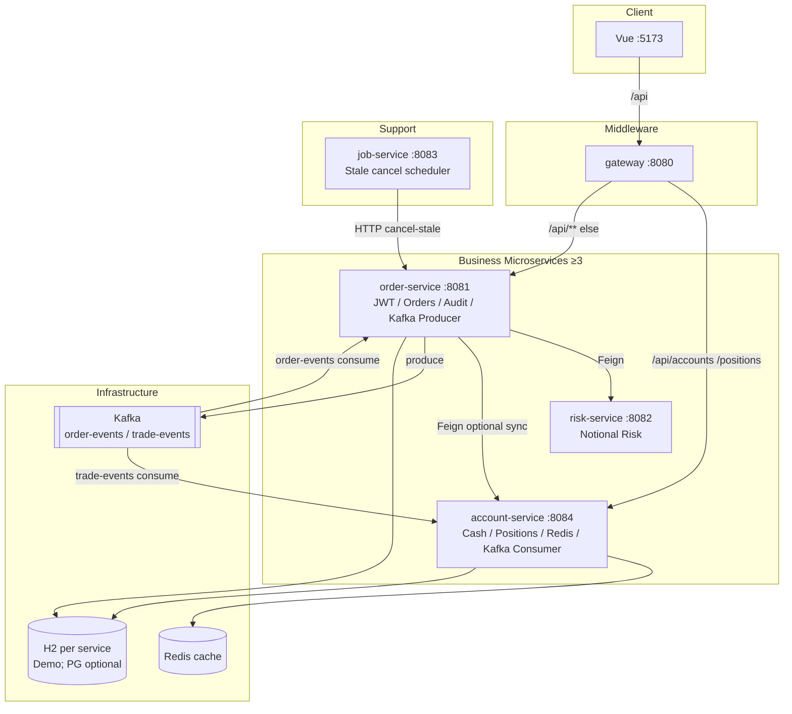

# FinTechDemo — Architecture（模組化 × 分散式）

> **為什麼長這樣**：[`技術次序與架構為什麼`](../guides/why.html) · 視覺 [`codeGraphic`](../portals/codeGraphic.html) · 落地細節 [`分散式系統落地`](distributed.html)  
> **定位**：展示用 **Distributed System Demo** — 進階功能刻意不做，但**模組邊界與事件鏈必須完整可講、可跑**。

---

## 1. 設計原則（這份作品的價值）

| 原則 | 本倉怎麼落地 |
|------|----------------|
| **模組化** | 一職責一可部署單元：order／risk／account／job／gateway／frontend／common |
| **分散式** | 同步用 Feign；非同步用 Kafka topic；快取用 Redis；入口用 Gateway |
| **可降級學習** | 預設 kafka／redis 關閉 → 單機仍可學劇情；`demo` profile 才開完整鏈 |
| **不堆進階** | 不做 Eureka／Config／部分成交／行情流 — 把力氣留在「邊界清楚」 |

---

## 2. 邏輯架構（完整系統）



---

## 3. 模組職責矩陣（對齊 Trading* 次序）

| 模組 | 埠 | 產品職責 | 技術職責 | 為何獨立 |
|------|-----|----------|----------|----------|
| `frontend` | 5173 | 登入／前台下單／後台查詢 | Vue Router、JWT、分頁 | 現場可見劇情 |
| `gateway` | 8080 | 唯一 API 入口 | Path 路由到 order／account；**RateLimitWebFilter**（固定窗口，超限 429） | Middleware |
| `order-service` | 8081 | 訂單生命週期、登入、審計 | JWT、JPA、Kafka **Producer**、AOP、Feign、**WebConfig CORS** | 交易編排 |
| `risk-service` | 8082 | 名義金額風控 | 無狀態規則服務 | 與下單生命週期分離 |
| `account-service` | 8084 | 餘額／持倉 | JPA 帳本、Kafka **Consumer**、**Redis** | 第三業務 MS；帳本邊界 |
| `job-service` | 8083 | 逾時取消觸發 | `@Scheduled` → HTTP | 排程與請求路徑分離 |
| `common` | — | 契約 | DTO、Topic、事件 | 跨服務不漂移 |
| `loadtest` | — | 壓測 | Locust | 證明層 |
| `deploy` | — | Compose + K8s | infra／overlay（含 **account**） | 上雲路徑 |

---

## 4. 事件與同步路徑（分散式核心）

```text
【非同步 Demo — kafka.enabled=true】
POST /api/orders
  → produce order-events
  → order Consumer：Feign risk → 訂單 ACCEPTED
  → produce trade-events
  → account Consumer：入帳 + Redis evict

【同步學習 — kafka=false】
POST /api/orders/{id}/execute
  → Feign risk → 本機帳本（standalone）
  → 可選 feign-sync → account-service（雙寫；預設關）
```

| Topic | Producer | Consumer | 觸發的「其他服務」 |
|-------|----------|----------|-------------------|
| `order-events` | order | order | **risk-service**（Feign） |
| `trade-events` | order | **account** | Redis cache 失效 |

---

## 5. 資料與快取邊界

| 資料 | 擁有者 | 說明 |
|------|--------|------|
| users / orders / audit_log | order-service | 登入與委託真相 |
| accounts / positions | **account-service**（正式敘事） | 現金／持倉；Redis 快取讀路徑 |
| order 內 H2 帳本 | order（standalone 便道） | 方便只起一個服務學習；可說明「正式走 account」 |

### 邊緣機制（Demo 可講）

| 機制 | 類別／位置 | 說明 |
|------|------------|------|
| 入口限流 | `gateway/.../filter/RateLimitWebFilter` | 每秒固定視窗；超限 **429**；Demo 用進程內計數（多副本見 APIGatewayMQ Redis） |
| CORS | `order-service/.../config/WebConfig` | 允許 Vue `:5173` 呼叫 `/api/**`（Security 鏈已 `.cors`） |
| Redis Cache | `account-service` `AccountQueryService` | cache-aside；key `account:{id}`／`positions:{id}`；TTL 60s；入帳 evict；`fintech.redis.enabled` 可關 |

---

## 6. 流量模式

| 模式 | 路徑 | 何時用 |
|------|------|--------|
| Minimal 學習 | Vue → order:8081 | 先跑通前後台劇情 |
| Distributed Demo | Vue → Gateway → order／account + Kafka + Redis | 主打分散式 |
| Job | job → order internal cancel-stale | 排程示範 |

---

## 7. 刻意不做（保持架構乾淨）

- Eureka／Config Server（固定 URL；口述可換 `lb://`）
- 部分成交／Level-2／出入金／KYC
- 把帳本再拆第五個業務服務、或上 CQRS 全套

---

## 8. 設定入口

- **統一學習入口（書櫃）**：[docs/index.html](../index.html)
- **學習導引地圖（雙軌路線）**：[learning-map.html](../portals/learning-map.html)（請用 ASCII 網址）
- **MD 閱讀器**：[md-reader.html](../md-reader.html)
- 埠與變數：[`engineering-config`](engineering-config.html)
- API 互動：[`swagger`](../portals/swagger.html)
- 驗證：`.\scripts\check.ps1`、`.\scripts\check-k8s.ps1`、`.\scripts\smoke-distributed.ps1`
- K8s 跑通／故障排除：[`K8s跑通與驗證技巧`](../deploy/k8s-tips.html)
- 上線部署階段層次：[`上線部署階段層次`](../portals/stages.html)
- 啟動：`.\scripts\start-demo.ps1`
