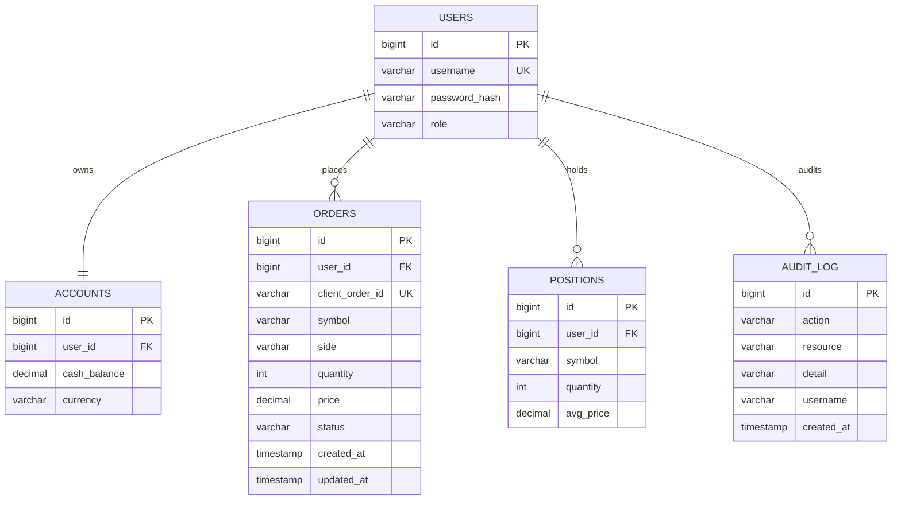

# FinTechDemo — 資料庫設計

## 引擎

| Profile | DB |
|---------|-----|
| local／test | H2（`MODE=PostgreSQL`） |
| docker／demo | PostgreSQL |

## ER Model（全部 tables）

> 列舉語意（圖上省略 `|`，避免 Mermaid erDiagram 語法錯誤）：  
> `role`＝USER／ADMIN；`side`＝BUY／SELL；`status`＝PENDING／ACCEPTED／REJECTED／CANCELLED。  
> `accounts.user_id`、`positions(user_id,symbol)` 為 UNIQUE（見下方索引）。

## 種子資料故事線（必須互相串連）

| 用戶 | 角色 | 餘額 | 訂單 | 持倉 | 審計 |
|------|------|------|------|------|------|
| trader1 | USER | **85000**（100000−15000） | ACCEPTED BUY AAPL 100@150；PENDING SELL AAPL 10@160；CANCELLED TSLA | AAPL 100 @150 | ORDER_ACCEPTED／CREATED／CANCELLED |
| admin | ADMIN | 100000 | PENDING BUY MSFT 20@300 | （無） | ORDER_CREATED |

驗證：`TradingFlowIntegrationTest.seedData_shouldLinkAllTables` + 前後台 API 整合案例。

## 索引

- `orders(user_id, created_at DESC)`  
- `orders(status)`  
- `positions(user_id, symbol)` UNIQUE  
- `accounts(user_id)` UNIQUE  

## 前後台 API ↔ 表

| API | 表 |
|-----|-----|
| POST/GET/DELETE `/api/orders*` | orders（+ execute 時 accounts／positions／audit_log） |
| GET `/api/accounts/me` | accounts |
| GET `/api/positions` | positions |
| GET `/api/audit-logs` | audit_log |
| 登入（P2） | users |
