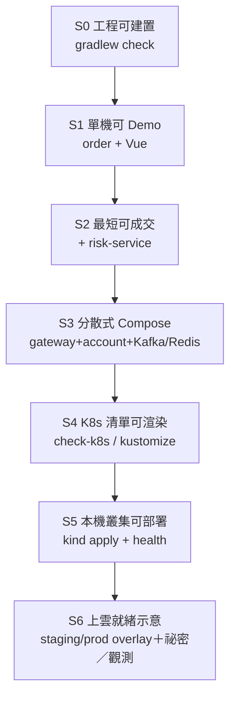

# FinTechDemo — 逐層打通：上線部署階段層次

> **怎麼用**：每一階段有「通過閘門」；**前一層未綠燈，不要跳下一層**。  
> **細節解法**（Docker／kind refused 等）：[`K8s跑通與驗證技巧`](k8s-tips.html)  
> **視覺版**：[`上線部署階段層次.html`](../portals/stages.html)

---

## 總覽（一圖）



| 階段 | 名稱 | 你證明了什麼 | 官方指令（通過閘門） |
|------|------|--------------|----------------------|
| **S0** | 工程可建置 | 程式／測試／設定語法正確 | `.\scripts\check.ps1` 或 `.\gradlew.bat check` |
| **S1** | 單機可 Demo | 登入→下單劇情在本機成立 | `:order-service:bootRun` + `frontend npm run dev` |
| **S2** | 最短可成交 | Feign 風控鏈通 | 再開 `RiskServiceApplication` :8082 |
| **S3** | 分散式 Compose | 多容器＋Kafka／Redis／Gateway 通 | `.\scripts\verify-pipeline.ps1 -Up -Smoke` |
| **S4** | K8s 清單可渲染 | Manifest／overlay 結構正確 | `.\scripts\check-k8s.ps1` |
| **S5** | 本機叢集可部署 | 真 API server＋Pod Ready | Docker Ready → kind → build/load → `kubectl apply -k` |
| **S6** | 上雲就緒示意 | 多環境／祕密／觀測敘事可講 | overlay staging/prod、Secret、Ingress（本 Demo 可口述＋骨架） |

**對應驗證 L 層**（與 K8s 文件一致）：S0≈L0；S3⊃L1+L3；S4=L2；S5=L4。

---

## S0 — 工程可建置（不上線也必須過）

**目標**：倉庫隨時可驗證，無測試變更不算完成。

| 項目 | 內容 |
|------|------|
| 做什麼 | 跑單元＋整合；修好紅燈 |
| 通過 | `BUILD SUCCESSFUL` |
| 指令 | `.\scripts\check.ps1` |
| 失敗常見 | 編譯錯、測試紅、JDK≠21 |
| 產出 | 綠燈 CI 基礎 |

**閘門**：不過 S0 → 禁止談部署。

---

## S1 — 單機可 Demo（產品最小上線感）

**目標**：Demo 最短路徑：登入、下單、查歷史／餘額（order 內建 H2）。

| 項目 | 內容 |
|------|------|
| 做什麼 | 起 order:8081 + Vue:5173 |
| 通過 | 可登入 `trader1/password`；Swagger／前台可用 |
| 指令 | `.\gradlew.bat :order-service:bootRun`；`cd frontend; npm run dev` |
| 失敗常見 | 8081 被佔（舊 Grails／其他 Java） |
| 設定檔 | `order-service/.../application.yml` |

**閘門**：本機劇情通 → 才加微服務。

---

## S2 — 最短可成交（風控鏈）

**目標**：點「成交」時 Feign 打得動 risk。

| 項目 | 內容 |
|------|------|
| 做什麼 | 並行起 Risk:8082 |
| 通過 | 風控通過／拒絕行為符合 `fintech.risk.max-notional` |
| 指令 | IntelliJ `RiskServiceApplication` 或 `:risk-service:bootRun` |
| 設定 | order yml `fintech.services.risk-url` |

**閘門**：雙後端健康 → 才上分散式。

---

## S3 — 分散式 Compose（容器化「準上線」）

**目標**：多服務＋訊息＋快取在同一 Docker 網路跑通（**日常上線演練首選**）。

| 項目 | 內容 |
|------|------|
| 做什麼 | Redpanda、Redis、risk、account、order、gateway |
| 通過 | health UP；`-Smoke` API 過 |
| 指令 | `.\scripts\verify-pipeline.ps1 -Up -Smoke` |
| 前置 | `docker info` 有 **Server Version** |
| 設定 | compose `environment`、`application-demo.yml`（kafka/redis on） |
| 失敗常見 | 引擎未開、埠衝突、健康檢查超時 |

**閘門**：Compose 煙霧綠 → 才值得花時間在 K8s 叢集。

**技巧**：S3 已能講「分散式部署」；K8s 是編排形態，不是唯一上線方式。

---

## S4 — K8s 清單可渲染（部署契約）

**目標**：證明 `deploy/k8s` 可組出完整 YAML（**不需活叢集**）。

| 項目 | 內容 |
|------|------|
| 做什麼 | kustomize build overlay |
| 通過 | 輸出含 gateway／order／risk／account |
| 指令 | `.\scripts\check-k8s.ps1` |
| 失敗常見 | kubectl 未裝（會 SKIP）；YAML 語法錯 |

**閘門**：S4 綠 =「部署描述正確」；**不等于**已上線。

---

## S5 — 本機叢集可部署（Kind／真 API）

**目標**：Manifest 真的進叢集，Pod Ready，可打 health。

| 步驟 | 動作 |
|------|------|
| 5.1 | Docker 引擎 Ready |
| 5.2 | 重建／修復 kind：`TradingKubernetes\scripts\start-local.ps1 -RecreateCluster -SkipMvp -SkipBuild` |
| 5.3 | `kubectl get --raw=/readyz` 成功 |
| 5.4 | `docker build` 四服務 → `kind load` → `kubectl apply -k deploy/k8s/overlays/dev` |
| 5.5 | `kubectl -n fintech-demo get pods` 皆 Ready；port-forward 打 health |

**通過**：四 Deployment Ready + health UP。  
**細節／connection refused**：見 [`K8s跑通與驗證技巧`](k8s-tips.html) §4～§5。

**閘門**：S5 綠 =「本機 K8s 部署打通」；上雲前最後演練。

---

## S6 — 上雲就緒示意（生產前）

本 Demo **不強制**實作完整雲上環境；上線架構敘事建議具備：

| 項目 | 最低示意 | 正式雲上（後續） |
|------|----------|------------------|
| 多環境 | `overlays/dev` 已有 | 增 `staging`／`prod`（改 replicas、資源、tag） |
| 祕密 | yml 明文僅 Demo | K8s Secret／外部 Secret；JWT secret 勿進映像 |
| 入口 | ClusterIP | Ingress／Gateway API＋TLS |
| 資料 | H2／示意 | PostgreSQL StatefulSet 或託管 DB |
| 訊息／快取 | Compose 已證 | 託管 Kafka／Redis 或叢內 Helm |
| 觀測 | Actuator／prometheus 注解 | Prometheus＋Grafana＋告警 |
| GitOps | 手動 apply | Argo CD／Flux（對齊 TradingKubernetes） |

**通過（示意）**：能口述 S0→S5 路徑，並指出 prod 與 Demo 的差異清單。

---

## 逐層打通 Checklist（可列印）

```text
[ ] S0  .\scripts\check.ps1
[ ] S1  order bootRun + Vue；登入成功
[ ] S2  risk 起來；成交可過風控
[ ] S3  verify-pipeline.ps1 -Up -Smoke
[ ] S4  check-k8s.ps1
[ ] S5  kind API ready + apply -k + pods Ready
[ ] S6  多環境／Secret／Ingress／觀測差異已寫進文件或 overlay 骨架
```

**規則**：任一層失敗 → 停在該層修；**禁止**用「跳過 Compose 直接死磕 kind」當捷徑。

---

## 相關入口

| 文件／腳本 | 用途 |
|------------|------|
| `scripts/verify-pipeline.ps1` | S0＋S3／S4 一條龍 |
| `scripts/check-k8s.ps1` | S4 |
| `scripts/smoke-distributed.ps1` | S3 煙霧 |
| [deploy/README](deploy-readme.html) | K8s 短操作 |
| [K8s跑通與驗證技巧](k8s-tips.html) | S5 故障排除 |
| [分散式系統落地](../architecture/distributed.html) | 分散式敘事 |
| `TradingKubernetes/scripts/start-local.ps1` | kind 權威啟動 |

---

*與 SPEC Phase（P0 骨架…P10 Compose/k8s）互補：SPEC 講「做什麼功能」；本文講「部署成熟度怎麼一層層打通」。*
