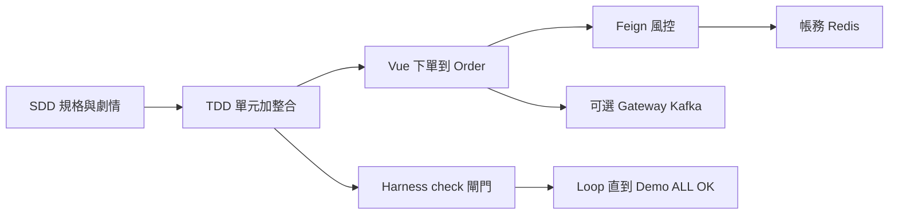
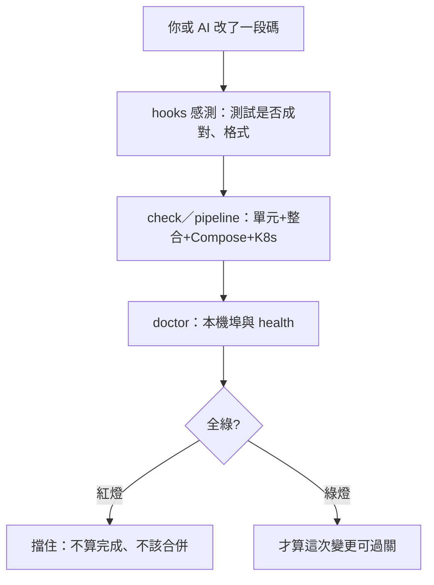

# FinTechDemo — 工程規範（SDD／TDD／Harness／Loop）

> 瀏覽：[`docs/guides/engineering-norms.html`](engineering-norms.html) · 手冊第 10 章：[`handbook.html#ch-norms`](../portals/handbook.html#ch-norms)  
> 部署關卡細節：[`loop-guide.html`](../portals/loop-guide.html) · 測試入口：[`testing`](../architecture/testing.md)  
> 公版：EngineeringOS `knowledge/agent-engineering.md`、`knowledge/testing.md`

**完成的定義 = 閘門全綠，不是模型或口頭說 OK。**

---

## 1. 一條鏈：規格 → 實作 → 閘門 → Demo

現場要能講、能跑的同一條敘事：



| 節點 | 在本專案是什麼 |
|------|----------------|
| SDD 規格與劇情 | `FinTechDemo-SPEC.md` 為權威；先對齊登入→下單→查餘額，再導入技術 |
| TDD 單元加整合 | 每個公開行為有單元；每個 API Happy Path + 錯誤路徑；契約變更必須成對更新 |
| Vue 下單到 Order | 前台 `/trade` → Order `:8081`（或經 Gateway `:8080`）寫 `PENDING` |
| Feign 風控 | Order → Risk `:8082` 名目風控，通過才成交 |
| 帳務 Redis | Account `:8084` 入帳／持倉；讀路徑 cache-aside，入帳 evict |
| 可選 Gateway Kafka | 分散式加分敘事；**不是**最短可成交的必要條件 |
| Harness check 閘門 | `check`／pipeline／hooks：紅燈不算完成 |
| Loop 直到 Demo ALL OK | verify → fix → verify（`.\開啟Demo.cmd`／`.\demo\doctor-demo.ps1 -Fix`） |

### 現場六步（務必可走完）

1. 登入 `trader1` / `password`  
2. `/trade` 下單  
3. Risk 成交（需 Risk `:8082`）  
4. `/portal` 看餘額／持倉／歷史  
5. admin 看 `/portal/audit`  
6. （加分）Gateway／Kafka／Redis  

---

## 2. 三個工具各當哪一道門

Harness Engineering 把「人工記得跑什麼」做成**自動感測器 + 通過／不通過閘門**。紅燈就不能算完成、不該合併、不該對外說 Demo 好了。

本專案三道門**擋的「壞」不一樣**：

| 工具 | 它在擋什麼 | 你實際的指令 |
|------|------------|----------------|
| **hooks** | 改碼當下的「漂移」：例如只改單元測試、沒改整合測試 | EngineeringOS `scan-paired-tests.ps1`、commit 前 lint |
| **pipeline** | 這次變更能不能當「可部署的成品」 | `.\demo\verify-pipeline.ps1`：`gradlew check` → `docker compose config` → K8s 清單 |
| **doctor** | 本機 Demo 現在能不能連（行程死了、埠空了） | `.\demo\doctor-demo.ps1`；`-Fix` 再把缺的服務拉起來 |



- **hooks**：像煙霧偵測器，問題剛出現就叫。  
- **pipeline**：像出廠檢驗，測「這版能不能過 CI／能部署」。  
- **doctor**：像現場體檢，測「現在 localhost 能不能 Demo」。

**pipeline 紅了**，多半是程式或設定壞了；**doctor 紅了**，常常是服務沒開（關掉終端、重開機），不一定是邏輯寫錯。兩者都是閘門，擋的「壞」不一樣。

### 指令速查

```powershell
# hooks（成對測試感測；在 EngineeringOS）
powershell -NoProfile -ExecutionPolicy Bypass -File `
  D:\ClaudeCode\EngineeringOS\eos-minimal\hooks\scan-paired-tests.ps1 `
  -ProjectRoot D:\ClaudeCode\FinTechDemo -IncludeGitDiffHint

# pipeline（可部署成品）
.\scripts\check.ps1                    # 僅 unit + integration
.\demo\verify-pipeline.ps1             # check + compose config + k8s
.\demo\verify-pipeline.ps1 -Up -Smoke

# doctor（本機能不能 Demo）
.\demo\doctor-demo.ps1
.\demo\doctor-demo.ps1 -Fix
.\開啟Demo.cmd                         # 本機 LOOP 直到可 Demo
```

---

## 3. SDD／TDD／Loop／Harness 怎麼分工

| 規範 | 管什麼 | 本倉落點 |
|------|--------|----------|
| **SDD** | 先寫規格與劇情，實作服從 SPEC | `FinTechDemo-SPEC.md`；薄 `CLAUDE.md` 只寫與公版差異 |
| **TDD** | 先測試再實作；單元 ↔ 整合成對 | `knowledge/testing.md`；`.\scripts\check.ps1` |
| **Harness** | 感測與閘門：自動發現問題並擋住壞變更 | hooks／`check`／`verify-pipeline`／`doctor-demo` |
| **Loop** | 節奏：失敗就修最小根因，重跑同一關直到綠 | `.\開啟Demo.cmd`／`.\demo\doctor-demo.ps1`；[`loop-guide.html`](../portals/loop-guide.html) |

禁止：跳過驗證入口宣告完成；用「本機沒跑」當通過；關掉 hook／`--no-verify` 掩蓋紅燈（除非使用者明確要求）。

---

## 4. 講本專案時的界線（勿誇大）

- **可講**：JWT＋RBAC 交易鏈、Feign 風控、Redis cache-aside、Kafka 可選事件、Compose／Kind 跑通、三道閘門。  
- **須標 Demo**：Kafka／Gateway 是加分路徑；本版 Feign 固定 URL（Eureka 為升級項）。  
- **勿講成**：券商級撮合、FIX、金檢系統、正式公有雲生產年資。
