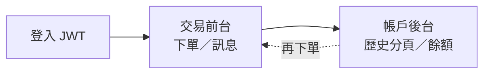
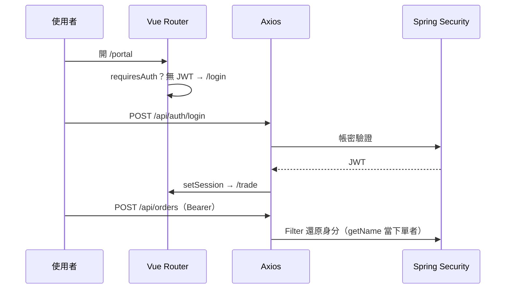
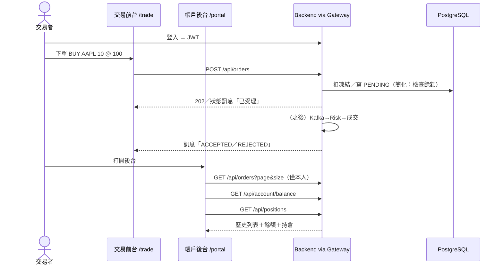

# FinTechDemo — 產品劇情：交易前台 × 帳戶後台

> **先有合理的交易故事，再導入 Gateway／Kafka／K8s。**  
> 前端技巧對齊 TradingCRUD：`Vue Router` + `meta.requiresAuth` + Axios Bearer。  
> 視覺：[`codeGraphic`](../portals/codeGraphic.html) Tab「⑤ 前台×後台」

---

## 1. 一句話劇情

使用者先**登入（JWT）** → 在**交易前台**下單並看交易訊息 → 到**帳戶後台**查**自己的成交／下單歷史（分頁）**與**餘額／持倉**。  
系統技術（Gateway、微服務、Kafka…）是為了支撐這條故事，不是反過來。

---

## 2. 兩個畫面，同一套身分

| 區域 | 路由（Vue） | 誰用 | 做什麼 | 對應後端 API |
|------|-------------|------|--------|--------------|
| 登入 | `/login` | 訪客 | 帳密換 JWT | `POST /api/auth/login` |
| **交易前台** | `/trade` | USER／ADMIN | 下單、看狀態／拒絕訊息 | `POST /api/orders`、訂閱或輪詢狀態 |
| **帳戶後台** | `/portal` | 同一使用者 | **我的**歷史分頁、餘額、持倉 | `GET /api/orders?mine`、`GET /api/account/balance`、`GET /api/positions` |
| 管理（可選） | `/admin` | 僅 ADMIN | 全站訂單、audit | `GET /api/admin/orders`、`GET /api/admin/audit-logs` |

**關鍵合理性**：前台產生交易資料 → 後台用**同一 userId（來自 JWT）**讀歷史與餘額；沒有「兩個無關系統」。

---

## 3. Vue Router + JWT（抄 TradingCRUD 技巧）

來源：`TradingCRUD/frontend/src/router/index.js`、`api/client.js`、`stores/auth.js`

| 技巧 | 作法 | 為什麼 |
|------|------|--------|
| `meta.requiresAuth` | `/trade`、`/portal`、`/admin` 需登入 | UX 擋未登入；**真授權仍在後端 Security** |
| `meta.guest` | `/login`；已登入則導向 `/trade` | 避免重複登入 |
| `beforeEach` + `unref(isLoggedIn)` | 守衛讀 computed 要用 unref | 否則守衛失效 |
| Axios Request Interceptor | 自動 `Authorization: Bearer` | 頁面不手動帶 token |
| Response 401（排除 login） | 清 session → `/login` | Token 過期體驗一致 |
| Vite proxy | `/api` → Gateway `:8080` | 開發免 CORS；正式也不直連多服務 |

---

## 4. 端到端劇情（Happy Path）

### 餘額怎麼合理（精簡版）

| 動作 | 餘額／持倉 |
|------|------------|
| 種子帳號 | `cash_balance` 初始例如 1_000_000 |
| 買單 ACCEPTED／FILLED | 現金減少 `qty * price`；持倉增加 |
| 賣單 ACCEPTED／FILLED | 持倉減少；現金增加 |
| 風控拒絕／餘額不足 | 不改餘額；前台顯示訊息 |

不做多幣別、保證金、部分成交 — Demo 故事夠用即可。

---

## 5. 前後端功能對照（都要有）

| 能力 | 前端 | 後端 |
|------|------|------|
| 登入 | LoginView + auth store | JWT FilterChain；公開 `/api/auth/**` |
| 下單 | TradeView 表單＋訊息區 | Order CRUD；身分綁 JWT user |
| 交易訊息 | Toast／狀態列（PENDING→…） | status 欄位；可選 SSE／輪詢 |
| 歷史紀錄 | Portal 分頁表（PagingList） | `PageResponse` + `user_id` 過濾 |
| 餘額查詢 | Portal 餘額卡片 | `accounts.cash_balance` API |
| 持倉 | Portal 持倉表 | `positions` |
| 權限 | router meta；ADMIN 顯示管理選單 | USER 只能看自己；ADMIN 可全站 |

---

## 6. 技術導入時機（劇情優先）

| 劇情已經通了之後 | 才導入 | 為什麼這時加 |
|------------------|--------|--------------|
| 單機 JWT＋CRUD＋前台後台頁 | — | **P1–P2＋早期 Vue**：先有故事 |
| 前端不該直連多埠 | Gateway | Middleware |
| 風控與下單分離 | risk-service | Microservice |
| 下單尖峰／「入隊≠成交」 | Kafka | 前台訊息改為「已受理，處理中」更合理 |
| 逾時單 | Job | 後台歷史會看到 CANCELLED |
| 審計 | AOP → audit_log | 後台／ADMIN 可查 |
| 證明 | Locust／Prom／K8s | 故事可跑後再證明 |

**實作調整**：Vue 前台×後台與 Paging／CRUD／JWT **同一階段就該有雛形**（不要等到全部後端分散式做完才做 UI）— 對齊你說的「先做 Paging／CRUD／JWT，才有被 Gateway 保護的東西」，且 **front-backend 一起**。

建議 Phase：

| Phase | 內容 |
|-------|------|
| P0 | 骨架 |
| **P1** | Order CRUD + 分頁 + **Account 餘額** + users |
| **P2** | JWT；USER 只能看自己的單／餘額 |
| **P2b** | **Vue：login／trade／portal**（Router+JWT，對齊 CRUD） |
| P3 | Gateway 接上（前端 proxy → Gateway） |
| P4 | Kafka（前台訊息改為非同步語意） |
| … | Job／AOP／觀測／壓測／K8s |

---

## 7. 種子帳號（Demo 劇情用）

| username | role | 初始餘額 | 用途 |
|----------|------|----------|------|
| `trader` | USER | 1,000,000 | 前台下單＋後台查自己 |
| `admin` | ADMIN | — | 可看全站／audit（可選） |

---

## 8. 相關文件

- [`codeGraphic`](../portals/codeGraphic.html) — 含前台×後台 Tab  
- [`資料庫設計`](../architecture/db.html) — 含 `accounts`  
- [`技術次序與架構為什麼`](why.html) — 技術層為什麼  
- TradingCRUD 範例：`frontend/src/router/index.js`、`api/client.js`
