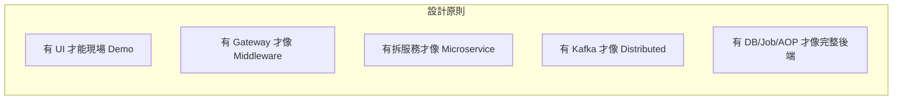
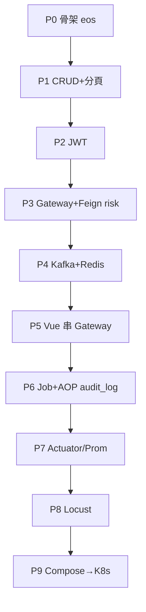
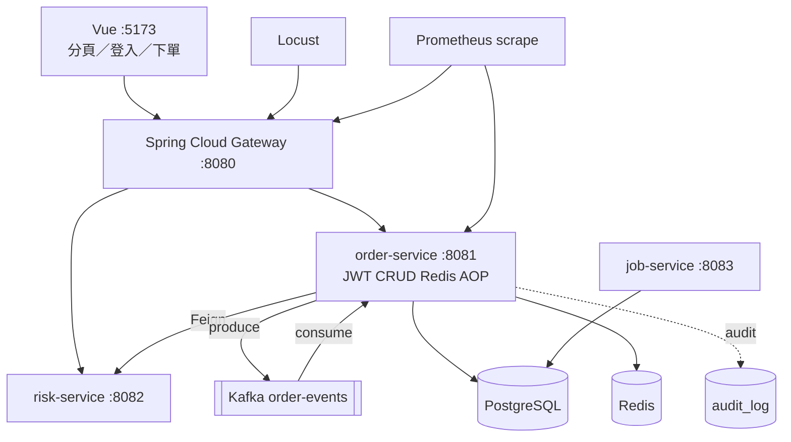

# FinTechDemo — 技術次序與架構為什麼

> 本文件是開發權威敘事：**先理解各 Trading* Demo 的技術次序，再決定 FinTechDemo 為什麼長這樣。**  
> 圖形版：[`codeGraphic.html`](../portals/codeGraphic.html)（雙擊開啟）

---

## 1. 你給的技術次序（技術堆疊順序）

這些不是隨機清單，而是**能力層層往上疊**：每一層解決上一層「站上舞台後會立刻被問到的下一個問題」。

```mermaid
flowchart TB
  subgraph L1["① 後端能力面"]
    P1[TradingPagingList<br/>伺服器端分頁]
    P2[TradingSpringSecurity<br/>JWT / 角色]
    P3[TradingCRUD<br/>分層 CRUD]
  end
  subgraph L2["② Middleware"]
    P4[TradingSpringCloud<br/>Spring Cloud Gateway]
  end
  subgraph L3["③ 分散式"]
    P5[TradingMicroService<br/>服務拆分 + Feign]
    P6[APIGatewayMQ<br/>Kafka 削峰]
  end
  subgraph L4["④ 橫切與排程"]
    P7[TradingJob<br/>@Scheduled]
    P8[TradingIocAOP<br/>AOP 審計]
  end
  subgraph L5["⑤ 證明與上雲"]
    P9[TradingLocustJMeter<br/>壓測]
    P10[TradingPrometheusActuator<br/>健康／指標]
    P11[TradingKubernetes<br/>Docker → K8s]
  end
  L1 --> L2 --> L3 --> L4 --> L5
```

| 次序 | 來源 | 解決的問題（為什麼要這步） |
|------|------|---------------------------|
| 1 | PagingList | 列表不能一次全撈 → **DB 端切片契約** |
| 2 | SpringSecurity | API 公開不安全 → **JWT Stateless + 角色** |
| 3 | CRUD | 要有可演示的業務面 → **Controller→Service→Repo** |
| 4 | SpringCloud | 前端不該直連多服務 → **Gateway 唯一入口** |
| 5 | MicroService | 風控與下單生命週期不同 → **拆服務 + Feign** |
| 6 | APIGatewayMQ | 同步寫入扛不住尖峰 → **Kafka 寫入削峰、查詢仍同步** |
| 7 | Job | 逾時單不會自己消失 → **排程掃終態** |
| 8 | IocAOP | 審計不該塞滿 Service → **AOP 橫切寫 audit** |
| 9 | LocustJMeter | 「感覺很快」不夠 → **可重跑壓測報告** |
| 10 | PrometheusActuator | 掛了怎麼知道 → **health + 業務 Counter** |
| 11 | Kubernetes | 本機 Demo ≠ 上雲路徑 → **Compose → Kustomize** |

**FinTechDemo 的價值**：把以上次序**收成一個可跑倉庫**，用一條鏈展示講完，不必再翻十個子專案。

---

## 2. 為什麼系統架構是「前端 → Gateway → MS → Kafka → 後端」

這不是裝飾，而是對應上面次序的**部署／請求形狀**：



| 架構層 | 為什麼要獨立成層 | 對應次序 | 採納技巧（來自子專案） |
|--------|------------------|----------|------------------------|
| **Frontend (Vue)** | 需要看得見的 UI；分頁／登入／下單是故事入口 | 1＋3 | Vite proxy、`PageResponse`、Axios Bearer（PagingList／CRUD） |
| **Gateway** | 前端只認一個 origin；路由改下游不改前端 | 4 | 固定 URL 路由、Path 對齊 `/api/**`（SpringCloud；可口述升級 `lb://`） |
| **Microservices** | order 編排、risk 規則、job 排程關注點分離 | 5 | Feign 介面契約、服務固定埠（MicroService 精簡版，**不搬 Eureka／Config**） |
| **Kafka** | 「入隊 ≠ 成交」；寫入可水平擴 consumer | 6 | 202＋topic、partition key、Idempotency-Key、local 可關 listener（APIGatewayMQ） |
| **Backend data** | 狀態真相在 DB；審計／排程依附資料 | 3＋7＋8 | JPA CRUD、Job→Service、`@AfterReturning` audit（升級為 `audit_log` 表） |
| **Obs / Perf / Cloud** | 證明可維運、可壓、可部署 | 9～11 | Actuator prometheus、Locust baseline、`apps`+`clusters` overlay |

---

## 3. 為什麼「實作順序」必須跟技術次序走

若先做 Kafka／K8s、後做 CRUD／Gateway，Demo 會變成「一堆基礎設施沒故事」。  
正確順序＝**先有可講的業務面，再往外長 Middleware／分散式／證明層**。



| Phase | 對應次序 | 完成時你能講的一句話 |
|-------|----------|----------------------|
| P1–P2 | 1～3 | 「我有受保護的分頁訂單 API」 |
| P3 | 4～5 | 「前端只打 Gateway；風控是另一個服務」 |
| P4 | 6 | 「下單進 Kafka，查詢同步讀」 |
| P5 | 前端打通 | 「現場瀏覽器走完整鏈」 |
| P6 | 7～8 | 「逾時有 Job；成功下單有 audit_log」 |
| P7–P9 | 9～11 | 「有指標、有壓測報告、有上雲 YAML」 |

`local` 可暫同步呼叫 risk（方便開發）；**demo／docker 主路徑必須 Kafka** — 否則次序第 6 步在展示會斷層。

---

## 4. 為什麼刻意「不搬」某些東西

| 不搬 | 來自 | 為什麼砍 |
|------|------|----------|
| Eureka + Config Server | MicroService | 可說明「可換成 lb://」即可；本機固定 URL 更穩 |
| Engine 多副本 Round-robin | APIGatewayMQ `EngineProxyService` | 一個 consumer group 示意即可 |
| R001～R010 | APIGatewayMQ／MVP | 一條名義金額規則夠講「風控服務」 |
| Node BFF | CRUD | Gateway 已是統一入口 |
| mini-ioc 手刻容器 | IocAOP | 只要 Spring AOP → DB `audit_log` |
| 雙 GitOps（Argo+Flux） | Kubernetes | Kustomize 三環境 overlay 夠 |

---

## 5. 目標架構（由次序推出的結果）



**一句話設計理由**：  
前端證明可用性 → Gateway 證明 Middleware → 多服務＋Kafka 證明分散式 → DB／Job／AOP 證明後端完整 → Actuator／壓測／K8s 證明工程與上雲。

---

## 6. 相關文件

| 文件 | 用途 |
|------|------|
| [codeGraphic.html](../portals/codeGraphic.html) | Tab＋Mermaid 視覺版（為什麼／次序／流量／部署） |
| [architecture](../architecture/architecture.html) | 模組職責與設定 |
| [技術融合對照](fusion.html) | 各來源「採納技巧／不搬」 |
| [FinTechDemo-SPEC](spec.html) | 權威規格與 Phase |
