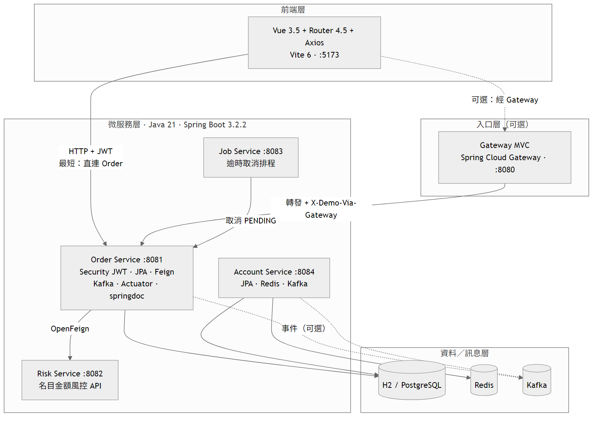
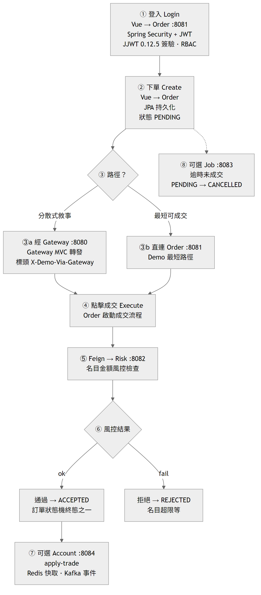
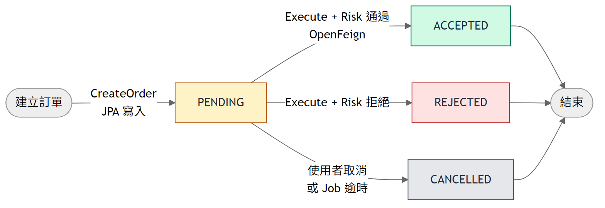

# FinTechDemo — 系統運作藍圖（GitHub／Redmine 用）

> 與 SPA「系統運作藍圖」`/blueprint` 同一套敘事。  
> 圖檔：`docs/architecture/mermaid/*.mmd`（需要時用 mermaid-cli 自行匯出）
> 遠端倉庫：[johnGitHub24/FinTechDemo](https://github.com/johnGitHub24/FinTechDemo)

本機互動藍圖：http://localhost:5173/blueprint（可不登入）

---

## 0. 啟動優先順序（Loop Engineering）

> 詳細步驟與圖：[docs/portals/demo-flow.html §2](../portals/demo-flow.html#s2)

| 優先 | 動作 | 說明 |
|------|------|------|
| P0 | 跑 `OrderServiceApplication` | 主入口 :8081 |
| P0+ | `DemoStackBootstrap` 自動 | `ApplicationReady` → `ensure-demo-links.ps1`（背景） |
| ① | Risk :8082 | 成交必備 |
| ② | Account :8084 | 帳務／Redis |
| ③ | Order | 已 UP → KEEP |
| ④ | Gateway :8080 | 統一入口 |
| ⑤ | Job :8083 | 可選排程 |
| ⑥ | Vite :5173 | 前端 |
| ⑦ | Docs :5500 | 學習 HTML |

設定：`fintech.startup.ensure-stack=true`（測試預設關）。日誌：`logs/ensure-from-order.*.log`。

---

## 0b. Docker／Redis

> **互動指令（複製鈕）**：http://localhost:5173/blueprint#docker-redis  
> 書櫃：http://127.0.0.1:5500/docs/index.html

要點：Desktop 沒 Ready → `dockerDesktopLinuxEngine`；`127.0.0.1:6379>` 是 redis-cli，不能打 `docker`。完整表與 NOTE 見藍圖 SPA。

---

## 0c. IntelliJ Services vs K8s

> **三層 Mermaid + 對照**：http://localhost:5173/blueprint#k8s-intellij  
> **一鍵**：`.\demo\start-k8s-demo.ps1` · **檢查**：`.\demo\k8s-walkthrough.ps1`  
> **故障**：[k8s-tips.html](../deploy/k8s-tips.html) · **地圖**：[文件完整度.md](../文件完整度.md)

| 在哪看 | 看什麼 |
|--------|--------|
| Docker Desktop → Images | 4× `fintech-demo/*:local` |
| Docker Desktop → Containers | `trading-local-control-plane` |
| kubectl / IntelliJ K8s | 4 Pod Running |
| IntelliJ context | `kind-trading-local` · `fintech-demo` |

L1：`.\demo\check-k8s.ps1` · L2：`.\開啟Demo.cmd` · L4：見上。

---

## 1. 技術棧

| 技術 | 版本 | 主要目的 | 本專案怎麼用 |
|------|------|----------|--------------|
| Vue | ^3.5.13 | 組前端畫面與互動（SPA） | Composition API；交易／後台／藍圖頁 |
| Vue Router | ^4.5.0 | 前端頁面路由與導覽守衛 | JWT 守衛；公開 `/blueprint` |
| Axios | ^1.7.9 | 瀏覽器發 HTTP 呼叫後端 API | Order／Gateway；Bearer；401 清 session |
| Vite | ^6.0.7 | 前端開發伺服器與打包建置 | :5173 HMR；`npm run build` |
| Mermaid | ^11.16 | 把流程／架構圖文字渲染成圖 | 僅藍圖頁動態載入 |

### 後端

| 技術 | 版本 | 主要目的 | 本專案怎麼用 |
|------|------|----------|--------------|
| Java | 21 | 後端業務邏輯的執行語言 | Gradle toolchain；Lombok |
| Spring Boot | 3.2.2 | 快速啟動 Web／微服務應用 | gateway／order／risk／account／job |
| Spring Cloud | 2023.0.0 | 統一鎖定微服務相關套件版本（BOM） | BOM＝版本總表；對齊 Gateway／OpenFeign |
| Gateway MVC | spring-cloud-gateway-server-mvc | 統一 API 入口、轉發到後端服務 | :8080 → Order；`RateLimitWebFilter`；`X-Demo-Via-Gateway` |
| OpenFeign | spring-cloud-starter-openfeign | 服務間用介面做同步 HTTP 呼叫 | 成交時 Order → Risk :8082 風控 |
| Spring Security | Boot starter | 認證與授權（誰能打哪些 API） | 登入、JWT 過濾、RBAC |
| WebConfig（CORS） | Spring MVC | 允許瀏覽器跨域呼叫 API | Order `config/WebConfig` → Vue `:5173` |
| JJWT | 0.12.5 | 在 Java 裡簽發／驗證 JWT 字串 | ≠ JWT 標準；HS 簽驗 |
| Spring Data JPA | Boot starter | 用物件操作資料庫（ORM） | Order／Account Repository |
| H2 | runtime | 本機／測試用輕量資料庫 | 記憶體庫；免 Docker Demo |
| springdoc OpenAPI | 2.3.0 | 自動產生 API 文件與試打介面 | :8081 Swagger UI |
| Actuator + Prometheus | Micrometer | 健康檢查與監控指標輸出 | health／prometheus |

### 基建／排程

| 技術 | 版本 | 主要目的 | 本專案怎麼用 |
|------|------|----------|--------------|
| Kafka | spring-kafka | 非同步訊息／事件串流 | order／account 事件（可選） |
| Redis | starter-data-redis | 高速快取／暫存狀態 | Account cache-aside（可選；TTL 60s／入帳 evict） |
| PostgreSQL | prod | 正式環境持久化關聯式資料庫 | docker／prod；local 用 H2 |
| Job Service | Boot 3.2 | 定時背景工作（排程任務） | :8083 逾時取消（不進 S 公式） |

**名詞**：JWT＝權杖標準；JJWT＝簽驗函式庫；BOM＝Bill of Materials（依賴版本總表）；OpenFeign＝服務間宣告式 HTTP 客戶端（**本版固定 URL**；升級 Eureka／`lb://` 見 SPEC §2.3——發現機制升級，非重寫業務）。

### 服務發現（本版 vs 升級）

| 項目 | 本版 FinTechDemo | 升級（口頭／TradingMicroService） |
|------|------------------|----------------------------------|
| Feign | `url = ${...-url}` 固定埠 | 拿掉 `url`，依服務名 |
| Gateway | 直連下游 URL | `lb://order-service` 等 |
| 註冊中心 | 不做（縮短最短可成交） | Eureka `:8761` |
| 結論 | 先跑穩交易鏈 | **發現機制升級，不是重寫業務** |

---

## 2. 分層架構

實線＝最短可成交主路徑；虛線＝可選（Gateway／Kafka／Job）。

- 最短：Vue `:5173` → Order `:8081` → Feign Risk `:8082`  
- 統一入口：再經 Gateway `:8080`（`RateLimitWebFilter` → 轉發）  
- Account／Redis Cache／Kafka、Job 為加分敘事  
- Order `WebConfig` CORS 允許 Vue 直連  

### 邊緣機制（Demo 可講）

| 機制 | 類別／路徑 | 職責 |
|------|------------|------|
| `RateLimitWebFilter` | `gateway/.../filter/` | 入口固定窗口限流；超限 429 |
| `WebConfig` | `order-service/.../config/` | CORS，允許 Vue `:5173` 呼叫 `/api/**` |
| Redis Cache | `account-service` `AccountQueryService` | cache-aside；TTL 60s；入帳 evict |

來源：[`mermaid/01-layers.mmd`](mermaid/01-layers.mmd) · SVG：[`images/01-layers.svg`](images/01-layers.svg)

---

## 3. 完整運作過程

分支「最短可成交」與「分散式敘事（經 Gateway）」匯入同一成交流程。

| 步驟 | 說明 |
|------|------|
| ① Login | Vue → Order；Spring Security + JWT（JJWT 簽驗）→ RBAC |
| ② Create | JPA 寫入 → `PENDING` |
| ③ 路徑 | 直連 Order，或經 Gateway MVC |
| ④ Execute | Order 啟動成交 |
| ⑤ Risk | OpenFeign → `:8082` 名目風控 |
| ⑥ 結果 | 通過 `ACCEPTED`／拒絕 `REJECTED` |
| ⑦ Account（可選） | apply-trade · Redis · Kafka |
| ⑧ Job（可選） | 逾時 → `CANCELLED` |

來源：[`mermaid/02-flow.mmd`](mermaid/02-flow.mmd) · SVG：[`images/02-flow.svg`](images/02-flow.svg)

---

## 4. 訂單狀態機

回答「這一筆單子到哪」——與 S1–S3「環境開到哪」是兩件事。

| 狀態 | 意義 |
|------|------|
| PENDING | 已建立，尚未成交／取消 |
| ACCEPTED | 成交且 Risk 通過 |
| REJECTED | 成交時風控拒絕 |
| CANCELLED | 使用者取消或 Job 逾時 |

來源：[`mermaid/03-order-state.mmd`](mermaid/03-order-state.mmd) · SVG：[`images/03-order-state.svg`](images/03-order-state.svg)

---

## 5. 部署階梯 S1–S3

| 階 | 條件 | 意義 |
|----|------|------|
| S1 | Order :8081 | 可登入／建 PENDING |
| S2 | Order + Risk :8082 | 最短可成交 |
| S3 | S2 + Gateway 或 Account | 統一入口／帳務敘事 |
| — | Job :8083 | 可選；不進 S 公式 |
| S4+ | K8s 等 | 僅文件／手動講解 |

---

## 6. 埠對照

| Port | 服務 | 角色 |
|------|------|------|
| 8080 | Gateway | 統一入口＋RateLimitWebFilter（可選） |
| 8081 | Order | 登入／下單／成交／審計／WebConfig CORS |
| 8082 | Risk | 名目風控（成交必開） |
| 8083 | Job | 逾時取消（可選） |
| 8084 | Account | 餘額／持倉／Redis Cache／Kafka（可選） |
| 6379 | Redis | Account 快取（可選；`docker compose up -d redis`） |
| 5173 | Vue Dev | 前端 SPA |
| 3000 | Grafana | 把監控數字畫成圖表；登入 admin／admin |
| 9090 | Prometheus | 定時收集各服務數字；可查詢／看曲線 |
| 8089 | Locust | 模擬很多人打 API 做壓測 |

---

## 7. 觀測／壓測怎麼用（簡易）

記法：**Locust＝壓力** → **Prometheus＝帳本** → **Grafana＝畫圖**。

1. `docker compose --profile monitoring up -d` → Grafana `:3000`（`admin`／`admin`）、Prometheus `:9090`
2. Prometheus Graph 範本：`up{job=~"fintech-.*"}`；Order RPS：`sum(rate(http_server_requests_seconds_count{job="fintech-order"}[1m]))`
3. Grafana → **FinTechDemo Overview**
4. Locust：見 `loadtest/README.md` → `:8089`

SPA 互動教學：http://localhost:5173/blueprint#observe

---

## 8. K8s 驗證

| 入口 | 用途 |
|------|------|
| [藍圖 #k8s-intellij](http://localhost:5173/blueprint#k8s-intellij) | Docker↔K8s 三層 Mermaid、Desktop／IntelliJ 對照 |
| [藍圖 #k8s-verify](http://localhost:5173/blueprint#k8s-verify) | kubectl 四步 |
| [k8s-tips.html](../deploy/k8s-tips.html) | L0～L4、故障排除 |
| [文件完整度.md](../文件完整度.md) | 單一真相、勿重複維護清單 |

---

## 貼到 Redmine

1. 新建 Wiki／議題說明，標題可用「FinTechDemo 系統運作藍圖」。  
2. 將本檔 Markdown 貼上（或附連結到 GitHub 本頁）。  
3. 圖片請一併上傳 `docs/architecture/images/*.png`，或直接用 GitHub raw／blob 圖鏈（需 public repo）。  

GitHub 本頁：`docs/architecture/系統運作藍圖.md`
